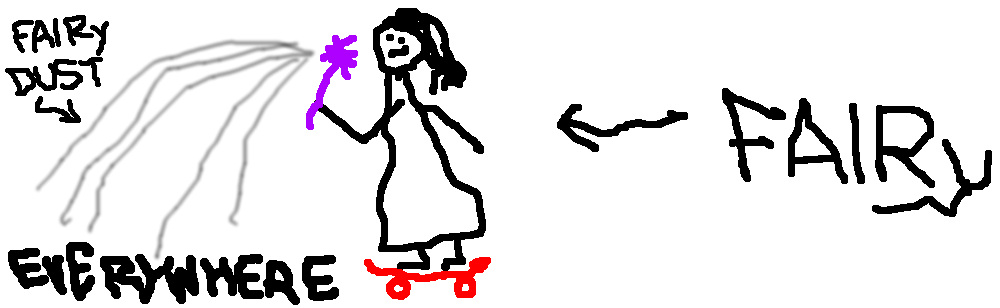
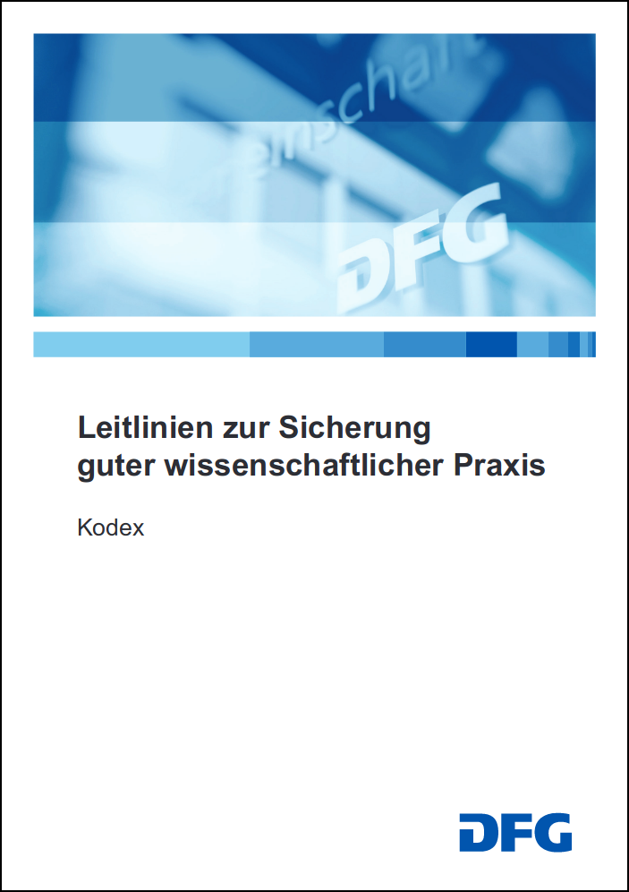
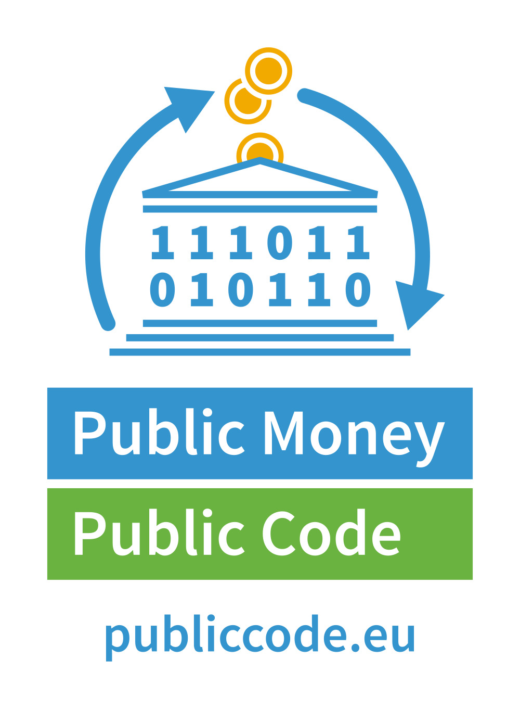
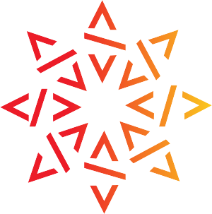
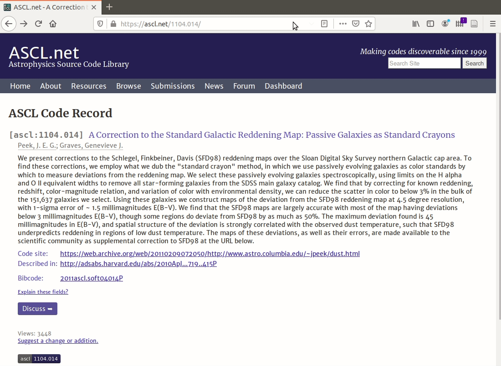
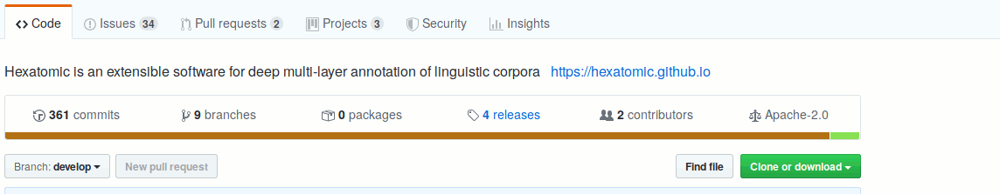
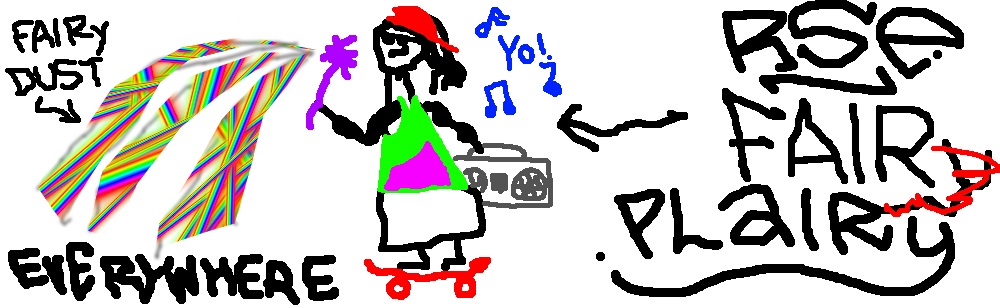

# Is FAIR software fair enough?

# Spoiler: It's not.

# But: There's something great about FAIR!

## FAIR \<insert digital artifact class here\><br/>BETTER RESEARCH

. . .

::: {.large}

- FAIR makes research possible, easier, and better

:::

. . . 

::: {.large}

- FAIR doesn't obstruct Open Science  
(unlike some publishers)


:::

::: notes
### - "Science"/"Research" not "Open Science"
### - Science that's not open is not traceable, and therefore not knowledge
:::

## FAIR, the brand

::: {.large}

- FAIR, FAIR, everywhere  
(it's almost as if ...)

:::

. . .

::: {.center}



:::

::: notes
### - PIs, institutional management and funders are recognizing FAIR as something desirable
### - Therefore they increasingly ask you to make your research artifacts FAIR
:::

## FAIR, the brand

:::::::::::::: {.columns}
::: {.column width="55%"}

- We, the research software community, can make use of the brand, e.g.:
    - Policy changes create leverage (to campaign for RSE, or FAI**RSE**)
    - May increase visibility for software sustainability concerns

:::
::: {.column width="40%"}

::: notes
### - FAIR has found its way into Good Scientific Practice Guidelines
### - If FAIR becomes a part of Good Scientific Practice, we can leverage the brand
### - FAIR is expensive, it costs resources
### - So under the FAIR flag, we can better campaign and lobby for the installation of RSEs across the system
:::



:::
::::::::::::::

# Is FAIR enough?

## Probably not! [@katzFAIRNotFair2017], [@daniels.katzFAIRNotFair2018], [@lamprechtFAIRPrinciplesResearch2019]

. . .

::: {.center .large}
<br/>

FAIR != OPEN

:::

. . . 

::: {.center .large}

FAIR != CREDIT

:::

. . .

::: {.center .large}

FAIR != GOOD

:::

::: notes
### - Research - including ALs - has shown that its hard to just re-use FAIR for software, mainly for the following reasons
### - The FAIR PRINCIPLES don't require research artifacts to be OPENLY available
### - To not share is not FAIR, and research should be open to benefit the research community and the general public
### - FAIR doesn't cater for CREDIT
### - But credit still is the main currency in research
### - Credit for RSEs would enable better research through better software
### - QUALITY concerns the usability and functionality of software,
### - FAIR covers the form of software (as data),
### - but RE-USABILITY heavily relies on adequate software quality
:::

## Perhaps we don't need FAIR Software, but rather rules of FAIR PLAY for software!

::: {.large .center}

FAIR PLAY?<br/><span style="color:lightgray; font-size: 70%;">(I'm sure there's a backronym in there somewhere)</span>

:::

. . .

::: {.large}

FAIR PLAY Software is ...

**F**indable, **A**ccessible, **I**nteroperable, **R**eusable,<span class="fragment"><br/>and **P**er default open source,</span> <span class="fragment">**L**icensed,</span> <span class="fragment">**A**ttributing contributions to it (for credit),</span> <span class="fragment">and of adequate qualit**Y**!</span>

:::

::: notes
### - Here's an idea: Perhaps, instead of trying to squeeze software into FAIR,
### - we should extend the FAIR brand to cater for open, citable, quality software.
### - "Licensed" because it's a requirement for re-use
:::

# FAIR PLAY == FAIR + RSEng

## RSEs be FAIR to the world

- Publicly funded research products (software) [belong to the public](https://publiccode.eu/)
- Use (permissive) open source licensing
- Publish your software proactively in a registry, get a PID (DOI)
- Archive your software sustainably ([Software Heritage](https://www.softwareheritage.org/))

::: {.center}
  
:::

::: notes
## RSE?
:::

## RSEs be FAIR to others

- Do your best to ensure that your software is of "adequate quality", so that downstream users can:
    1. understand it,
    1. use it,
    1. trust it.
    1. change it.
- How do we measure software quality?  
(Internal) metrics? Peer review? Usage?
- Best practices: VCS, CI, tests, documentation, code review, etc.

::: notes
### - "Adequate": costly software should be of high quality, modularized, etc.
### - Scripts may not need docs, but need to be citable when used in research (reproducibility)
### - Software quality measurement should be answered in Software Engineering
:::

## RSEs be FAIR to themselves

::: {.large}
- Make your software citable ("A" in "PLAY")
- Provide citation metadata
:::

::: notes
### - You want to be credited for your software world, because otherwise you'll have no career
### - And if you don't have a career, you won't be around to create better software for better research
:::

## Okay, also be FAIR to others (again)

::: {.large}
- Cite software that you use
- Do so both in your papers and in your software
:::

::: notes
### - Cite software from software via metadata
### - Cite your dependencies
### - If we want software to be treated as a valid research product, we should treat it the same as papers
### - This includes providing a reference list
### - citing other research that your research builds on

### - Burnistoun?
:::

## "Haud on a b\*\*\*in' minute here, Joe!<br/>Have ye noticed somethin?"

::: {.center}

 

:::

## "Haud on a b\*\*\*in' minute here, Joe!<br/>Have ye noticed somethin?"

::: {.large}

**Q:** So **I, RSE,** am supposed to do all the hard and tedious (metadata) work then?

**A:** Yes. (But we are trying to make it simpler.)

:::

::: notes
### - Yea! That's actually your job!
### - And it's what you should be doing already (Good Scientific Practice)
### - It is a studenty place
### - As RSEs, we cannot pick the carrot and discard the stick
### - we're also obliged to stick to GSP
### - Academic rigour is the price we pay for the advantages (interesting, freedom)

### - But we promsie to make it simpler.
### - Quality is your main concern anyway, right?
### - Accessibility via Open Source is your practice already, right?
### - Then what about citation?
:::

# Citation metadata 101

## CITATION files

- Citation File Format (CFF, *YAML*) [@druskat_stephan_2018_1405679]: [citation-file-format.github.io](https://citation-file-format.github.io/)
- (Alternatively CodeMeta (*JSON-LD*) [@jonesCodeMetaExchangeSchema2017a]: [codemeta.github.io](https://codemeta.github.io/))

```yaml
# CITATION.cff
cff-version: 1.1.0
message: "If you use this software, cite it using these metadata."
authors:
  - family-names: "Druskat"
    given-names: "Stephan"
    orcid: https://orcid.org/0000-0003-4925-7248
title: "My Research Software"
version: "2.0.4"
doi: "10.5281/zenodo.1234"
date-released: 2017-12-18
```

## Manual creation & curation

::: {.large}
- Copy, paste & adapt the example, *or*
- use a simple webservice: [citation-file-format.github.io/cff-initializer-javascript/](https://citation-file-format.github.io/cff-initializer-javascript/).
- Put `CITATION.cff` in the root of your source code repository.
:::

## Auto-generation

- Let your build (soon for Maven, incl. dependencies) or registry do it

::: {.center}

:::

## "But how do I get the Zenodo DOI into the release CITATION.cff file automagically?"

::: {.large .center}
a.k.a. 🐔🥚

We're working on it. With Zenodo 💖!
:::

## And perhaps one day ...



# Conclusion

## FAIR Software {data-transition="slide-in none-out"}


## FAIR Software + practice of FAIR PLAY {data-transition="none-in slide-out"}



## Conclusion proper

. . .

::: {.large}
- FAIR does not work fully for software
:::

. . . 

::: {.large}
- FAIR is an established "brand"
:::

. . . 

::: {.large}
- Research software can leverage the brand
:::

. . . 

::: {.large}
- Even if we fail to define FAIR Software,  
FAIR + RSE = FAIR PLAY can achieve for software  
what FAIR has achieved for data
:::

::: notes
### - Nevermind the branding, it's the practice under the hood that matters
:::

## Thanks! {style="text-align: center;"}

::: {.center}

[citation-file-format.github.io](https://citation-file-format.github.io)  
[github.com/citation-file-format/citation-file-format](https://github.com/citation-file-format/citation-file-format )

stephan.druskat@dlr.de  
Twitter: [\@stdruskat](http://twitter.com/stdruskat)  
ORCiD [0000-0003-4925-7248](https://orcid.org/0000-0003-4925-7248)  
Slides: [doi:10.6084/m9.figshare.10565717](https://doi.org/10.6084/m9.figshare.10565717)

:::

# Appendix

## Image credits

::: {.small}

- DFG Kodex cover, assumed © by [Deutsche Forschungsgemeinschaft](https://www.dfg.de/en/research_funding/principles_dfg_funding/good_scientific_practice/index.html) (under fair use)
- Burnistoun animated GIF from [BuzzFeed](https://img.buzzfeed.com/buzzfeed-static/static/2017-07/25/10/asset/buzzfeed-prod-fastlane-01/anigif_sub-buzz-28377-1500993996-1_preview.gif?downsize=800:*&output-format=auto&output-quality=auto), assumed © by BBC (under fair use)
- Elsevier logo in the public domain 
- Public Money Public Code logo by Free Software Foundation Europe 
- Software Heritage logo courtesy of Software Heritage
- The Open Source Initiative Keyhole Logo by The Open Source Initiative 

:::

### FAIRy "art" - use at your own risk

::: {.small}

- FAIRy by me 
- FAIR PLAIry also by me 

:::

## References {.small}