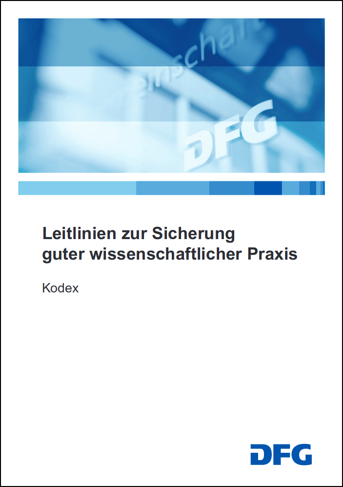
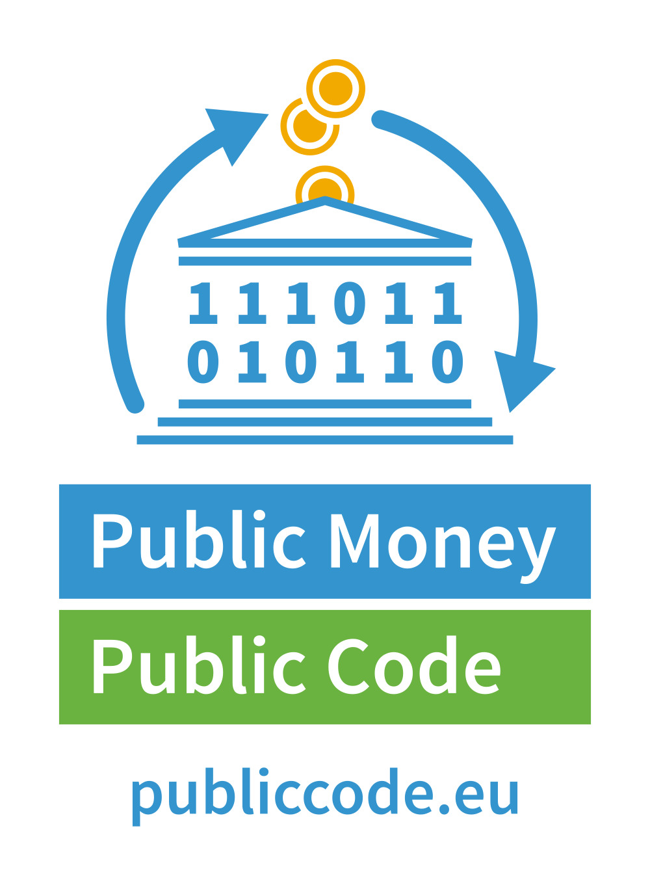
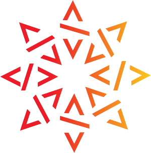
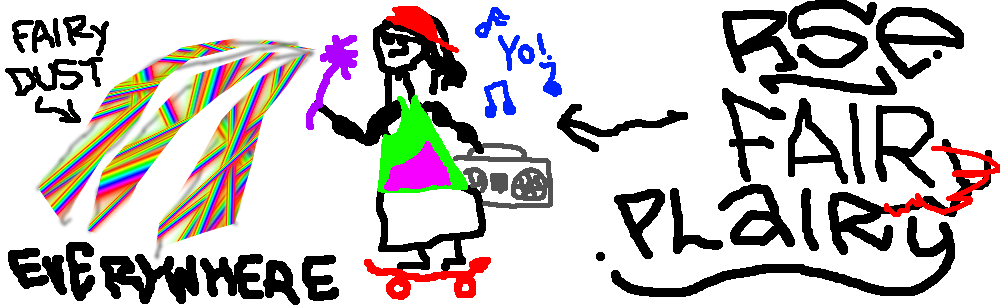

# Is FAIR software fair enough?

# Spoiler: It's not.

# But: There's something great about FAIR!

## FAIR \<insert digital artifact class here\> BETTER RESEARCH

. . .

::: {.large}

- FAIR makes research possible, easier, and better

:::

. . . 

::: {.large}

- FAIR doesn't obstruct Open Science  
(unlike some publishers)

:::

## FAIR, the brand

::: {.large}

- FAIR, FAIR, everywhere  
(it's almost as if ...)

:::

. . .

::: {.center}

:::

## FAIR, the brand

:::::::::::::: {.columns}
::: {.column width="55%"}

- We, the research software community, can make use of the brand, e.g.,
    - Policy changes create leverage (FAI**RSE** anyone?)
    - Visibility for software sustainability concerns

:::
::: {.column width="40%"}

:::
::::::::::::::

# Is FAIR enough?

## Probably not! [@blog], [@slides], [@ds]

. . .

::: {.center .large}

FAIR != OPEN [TODO: From Dan's blog]

:::

. . . 

::: {.center .large}

FAIR != CREDIT [There's no fair trade in FAIR, explain]

:::

. . .

::: {.center .large}

FAIR != GOOD [Quality TODO, concerns the functionality fo software, not the form (covered by FAIR)]

:::

## Perhaps we don't need "FAIR" for software, but rather rules of FAIR PLAY!

[TODO: Instead of trying to squeeze software into FAIR, we should extend FAIR to cover software]

::: {.large .center}

FAIR PLAY? (I'm sure there's a backronym in there somewhere)

:::

. . .

::: {.large}

FAIR PLAY Software is ...

**F**indable, **A**ccessible, **I**nteroperable, **R**eusable, and **P**er default open source, therefore **L**iterally accessible, **A**ttributing contributions for credit, and of high qualit**Y**!

:::

# FAIR PLAY == RSEng! [TODO]

## RSEs be FAIR to the world

- Publicly funded research products (software) [belong to the public](https://publiccode.eu/)
- Use (permissive) open source licensing
- Publish your software proactively
- Archive your software sustainably ([Software Heritage](https://www.softwareheritage.org/))

::: {.center}
  
:::

## RSEs be FAIR to others

- Try to ensure that your software is of "high quality", so that other researchers can trust it.
- How to judge software quality (internal metrics, peer review, usage)
- Best practices: tests, docs, code review, etc.

## RSEs be FAIR to themselves

- Make your software citable (A in play)

## Okay, also be FAIR to others again

- Cite software that you use
- ... in your papers and your software

## "Haud on a b\*\*\*in' minute here, Joe! Have ye noticed somethin?"

::: {.center}

 

:::

## "Haud on a b\*\*\*in' minute here, Joe! Have ye noticed somethin?"

::: {.large}

**Q:** So **I** am supposed to do all the hard and tedious metadata work then?

**A:** Yes. (But we are trying to make it simpler.)

:::

<!--Yea! But that's already what you should be doing according to good scientific principles.
As RSEs, we cannot pick the carrot and discard the stick, we're also obliged to stick to them,
we have all the advantages of interesting work with a high degree of freedom on avaerage,
but we also need to accept the disadvantages that come with it, i.e., academic rigour!

But we promsie to make it simpler.
Quality is your main concern anyway, right?
Accessibility as open source is your practice already, right?
So take citation! -->

# Case study: cite & make citable [TODO]

## asd

# Conclusion

## FAIR Software {data-transition="slide-in none-out"}

## FAIR Software + practice of FAIR PLAY {data-transition="none-in slide-out"}

## Thanks! {style="text-align: center;"}

::: {.center}

[citation-file-format.github.io](https://citation-file-format.github.io)  
[github.com/citation-file-format/citation-file-format](https://github.com/citation-file-format/citation-file-format )

stephan.druskat@dlr.de  
Twitter: [\@stdruskat](http://twitter.com/stdruskat)  
ORCiD [0000-0003-4925-7248](https://orcid.org/0000-0003-4925-7248)  
Slides: [doi:10.6084/m9.figshare.10296917](https://doi.org/10.6084/m9.figshare.10296917) [TODO]

:::

# Appendix

## Image credits

::: {.small}

- DFG Kodex cover, assumed copyright by [Deutsche Forschungsgemeinschaft](https://www.dfg.de/en/research_funding/principles_dfg_funding/good_scientific_practice/index.html) (under fair use)
- Burnistoun animated GIF from [BuzzFeed](https://img.buzzfeed.com/buzzfeed-static/static/2017-07/25/10/asset/buzzfeed-prod-fastlane-01/anigif_sub-buzz-28377-1500993996-1_preview.gif?downsize=800:*&output-format=auto&output-quality=auto), assumed copyright by BBC (under fair use)
- Elsevier logo in the public domain 
- Public Money Public Code logo by Free Software Foundation Europe 
- Software Heritage logo by
- The Open Source Initiative Keyhole Logo by The Open Source Initiative 

:::

### FAIRy "art" - use at your own risk

::: {.small}

- FAIRy by me 
- FAIR PLAIry also by me 

:::

## References [TODO]